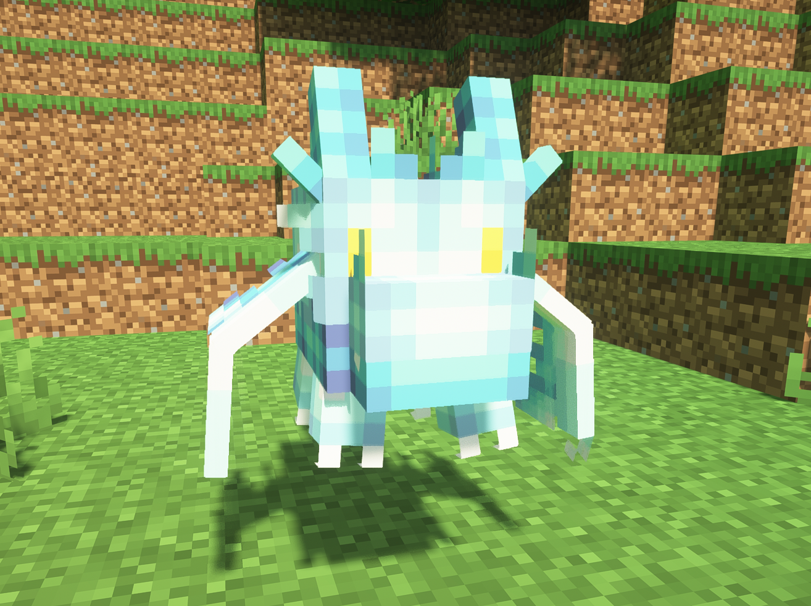

# 🐶 Pets

## Aether Dragon

Get your pet Aether Dragon!

* **Ability: Flash** Your Aether Dragon creates a flash of light, stunning nearby enemies.

<figure><figcaption></figcaption></figure>

## Angel

Get your pet Angel!

* **Ability: Heavenly heal** Your Angel heals you with a beam of heavenly light.

<figure><figcaption></figcaption></figure>

## Demon

Get your pet Demon!

* **Ability: Power up** Your Demon gives you a strength buff.

<figure><figcaption></figcaption></figure>

## Eagle

Get your pet Eagle!

* **Ability: Dash** Your Eagle dashes towards its enemy, setting them airborne.

<figure><figcaption></figcaption></figure>

## Fire Dragon

Get your pet Fire Dragon!

* **Ability: Fireball** Your Fire Dragon shoots a fireball at the enemy.

<figure><figcaption></figcaption></figure>

## Frost Wolf

Get your pet Frost Wolf!

* **Ability: Ice Fangs** Your Frost Wolf bites the enemy, freezing them.

<figure><figcaption></figcaption></figure>

## Hellhound

Get your pet Hellhound!

* **Ability: Fire Claws** Your Hellhound swipes the enemy, burning them.

<figure><figcaption></figcaption></figure>

## Ice Dragon

Get your pet Ice Dragon!

* **Ability: Ice Breath** Your Ice Dragon breathes out cold air, freezing enemies.

<figure><figcaption></figcaption></figure>

## Lunar Wolf

Get your pet Lunar Wolf!

* **Ability: Moon Shield** Your Lunar Wolf gives you a moon shield that blocks any kind of attack.

<figure><figcaption></figcaption></figure>

## Nature Dragon

Get your pet Nature Dragon!

* **Ability: Healing Leaves** Your Nature Dragon creates a healing aura at your position.

<figure><figcaption></figcaption></figure>

## Phoenix

Get your pet Phoenix!

* **Ability: Burning path** Your Phoenix dashes towards its enemy, leaving a path of fire.

<figure><figcaption></figcaption></figure>

## Sai Ninja

Get your pet Sai Ninja!

* **Ability: Pierce Attack** Your Sai Ninja pierces the enemy with its sai.

<figure><figcaption></figcaption></figure>

## Samurai

Get your pet Samurai!

* **Ability: Katana Slash** Your Samurai spins his katana, damaging nearby enemies.

<figure><figcaption></figcaption></figure>

## Shadow Dragon

Get your pet Shadow Dragon!

* **Ability: Shadow Fangs** Your Shadow Dragon bites the enemy, levitating them for some time.

<figure><figcaption></figcaption></figure>

## Shuriken Ninja

Get your pet Shuriken Ninja!

* **Ability: Shuriken Toss** Your Shuriken Ninja throws a shuriken at the enemy.

<figure><figcaption></figcaption></figure>

## Thunderbird

Get your pet Thunderbird!

* **Ability: Spark ball** Your Thunderbird fires a ball of thunder, creating a chain of lightning between nearby enemies.

<figure><figcaption></figcaption></figure>

## Thunder Dragon

Get your pet Thunder Dragon!

* **Ability: Thunder Bolt** Your Thunder Dragon brings down thunder to 3 nearby enemies.

<figure><figcaption></figcaption></figure>

## Undead Dragon

Get your pet Undead Dragon!

* **Ability: Poison Breath** Your Undead Dragon breathes out poison gas, poisoning enemies.

<figure><figcaption></figcaption></figure>

## Wind Dragon

Get your pet Wind Dragon!

* **Ability: Tornado** Your Wind Dragon fires a tornado that pulls in nearby enemies.

<figure><figcaption></figcaption></figure>
